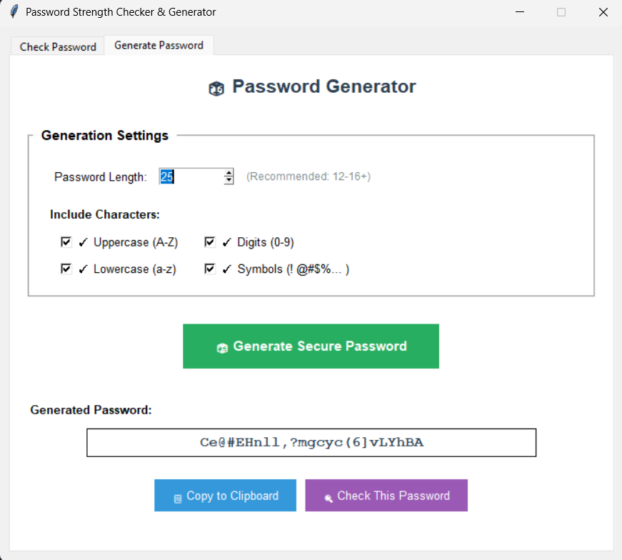

# 🔐 Password Strength Checker & Generator

[](https://github.com/bnahmedsoumaya00/cybersecurity-projects/releases/download/v1.0.0/PasswordChecker.exe)
[](https://github.com/bnahmedsoumaya00/cybersecurity-projects/releases/tag/v1.0.0)

A professional desktop GUI for password analysis and secure generation.

---

## 📥 Quick Download (Windows)

**[⬇️ Download PasswordChecker.exe](https://github.com/bnahmedsoumaya00/cybersecurity-projects/releases/download/v1.0.0/PasswordChecker.exe)**

_No install, just double-click. If Windows Defender warns, click "More info" → "Run anyway"._

---

## 🖥️ Screenshots




---

## ⚙️ Installation

**Option 1: Windows Executable**  
[Download from Releases](https://github.com/bnahmedsoumaya00/cybersecurity-projects/releases) and run.

**Option 2: Run from Source (Cross-Platform)**
```bash
git clone https://github.com/bnahmedsoumaya00/cybersecurity-projects.git
cd cybersecurity-projects/password-checker
python -m venv venv
venv\Scripts\activate    # or source venv/bin/activate on Mac/Linux
pip install -r requirements.txt
python password_checker.py
```

---

## 🚦 Features

- Password strength scoring & entropy
- Secure password generator (custom settings)
- Pattern & common password detection
- Show/hide, copy to clipboard
- GUI, easy to use

---

## 📦 Changelog

- **v1.0.0**: Initial public release  
  - Password checker/generator, GUI, bugfixes

[See all releases](https://github.com/bnahmedsoumaya00/cybersecurity-projects/releases)
